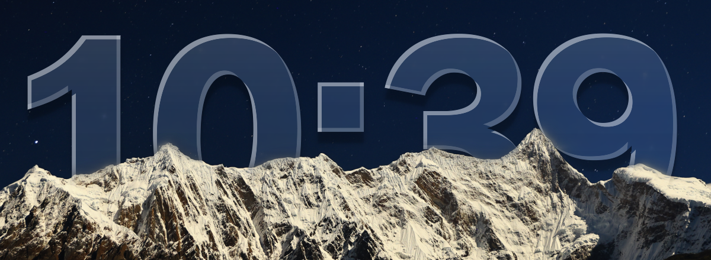
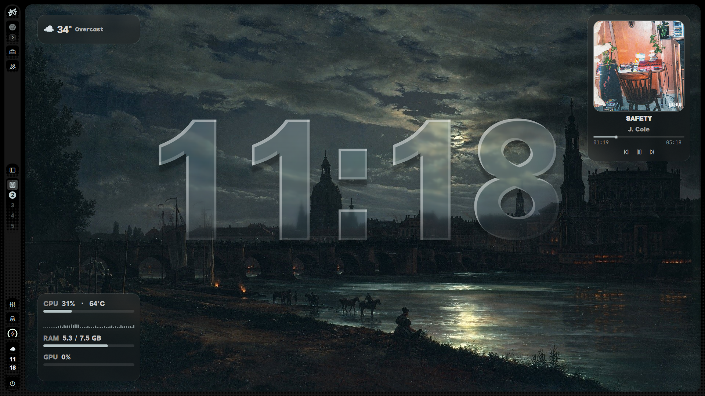

# Wallpaper Depth

A depth-effect clock for [Ambxst](https://github.com/Axenide/Ambxst): the time sits *between* your wallpaper and its foreground, so mountains, trees and buildings pass in front of it. Optionally, the clock becomes frosted liquid glass.



## Features

- **Depth effect.** A local depth model finds the foreground of each wallpaper and cuts it out; the clock is drawn behind the cutout.
- **Liquid glass style.** Toggle between solid text and frosted glass with adjustable frost, tint and edge light.
- **Auto text color.** Solid text switches between light and dark depending on how bright the wallpaper is *behind the clock*, wherever you put it.
- **Fully configurable from Settings → Mods.** Format (12/24-hour, seconds, custom), font, weight, size, text smoothing, and nine position presets with fine offsets.
- **Fast and private.** Everything runs locally. Each wallpaper is analysed once and cached.
- **Plays well with others.** Composes with [Wallpaper Transitions](https://github.com/POSiTiiiV/ambxst-mods/tree/main/packages/wallpaper-transitions) by [POSiTiiiV](https://github.com/POSiTiiiV) and [Desktop Widgets](https://github.com/And0Null/ambxst-mods/tree/main/packages/desktop-widgets) by [And0Null](https://github.com/And0Null).



*Used alongside [And0Null's Desktop Widgets mod](https://github.com/And0Null/ambxst-mods/tree/main/packages/desktop-widgets).*

## Requirements

- Ambxst `>=1.3.0 <2.0.0`
- Python 3 with `onnxruntime`, `numpy` and `pillow`
- The *Depth Anything V2 Small* model, about 99 MB (downloaded once, see below)
- Qt 6.7 or newer for the *Smooth* text option. Older Qt falls back to *Standard* automatically.

## Install

**1. One-time depth setup**

```
mkdir -p ~/.local/share/ambxst/depth && cd ~/.local/share/ambxst/depth
python3 -m venv venv
./venv/bin/pip install onnxruntime numpy pillow
curl -L -o model.onnx \
  https://huggingface.co/onnx-community/depth-anything-v2-small/resolve/main/onnx/model.onnx
```

**2. Install the mod**

You can install the mod through pasting this directory's url to Settings →  Mods then enabling it before reloading Ambxst, or through the terminal:

```
ambxst mods install https://github.com/Rip-RGH/ambxst-mods/tree/main/packages/wallpaper-depth
ambxst mods enable rip-rgh.wallpaper-depth
ambxst reload
```

Then open **Settings → Mods → Wallpaper Depth**. The first time a wallpaper is used, the clock appears after a few seconds while the depth map is generated.

## Settings

| Setting | Default | Options | What it does |
|---|---|---|---|
| **Depth effect** | on | on / off | Draw the clock behind the wallpaper's foreground. |
| **Liquid glass style** | off | on / off | Draw the clock as frosted glass instead of solid text: the wallpaper shows through the letters, with light edges and a soft shadow. |
| **Glass frost** | 40 | 0 to 100 | How blurred the wallpaper looks through the letters, from 0 (clear) to 100 (very frosted). |
| **Glass tint** | 35 | 0 to 100 | How strongly the glass is tinted, from 0 to 100. |
| **Glass edge highlight** | 70 | 0 to 100 | Strength of the light along the edges of the letters, from 0 to 100. |
| **Clock format** | 24-hour (14:05) | 24-hour (14:05), 24-hour with seconds (14:05:09), 12-hour (2:05 PM), 12-hour with seconds (2:05:09 PM), Custom | How the time is written. |
| **Custom format** | `HH:mm` | text | Only used when Clock format is Custom. |
| **Font** | empty | text | Name of an installed font family, for example Inter or JetBrains Mono (run fc-list : family to see what you have). |
| **Font weight** | Bold | Thin, Extra light, Light, Regular, Medium, Semi-bold, Bold, Extra bold, Black | Thickness of the clock text. |
| **Text smoothing** | Smooth (recommended) | Smooth (recommended), Standard, Native | How the clock's edges are drawn. |
| **Clock size, percent of screen height** | 22 | 5 to 40 | Height of the clock text relative to the screen. |
| **Clock color** | Auto (match wallpaper) | Auto (match wallpaper), Light, Dark, Theme | Auto picks light or dark text from how bright the wallpaper is behind the clock. |
| **Clock position** | Center | Top left, Top center, Top right, Middle left, Center, Middle right, Bottom left, Bottom center, Bottom right | Where the clock sits on the screen. |
| **Horizontal offset, percent of screen width** | 0 | -50 to 50 | Moves the clock sideways from the chosen position. |
| **Vertical offset, percent of screen height** | 0 | -50 to 50 | Moves the clock up or down from the chosen position. |
| **Foreground threshold** | 30 | 0 to 100 | How close something has to be to count as foreground, from 0 to 100. |
| **Edge softness** | 8 | 0 to 50 | Blur radius in pixels around the cutout edge, from 0 (hard) to 50 (very soft). |

Changes apply live. Long clock formats shrink automatically to fit the screen.

**Custom format.** A Qt date/time format: `HH` hour (24h), `h` hour (12h, with `AP`), `mm` minutes, `ss` seconds, `AP` for AM/PM, `ddd` / `dddd` weekday, `d` day, `MMM` / `MMMM` month. Put literal text in single quotes. For example, `ddd d MMM HH:mm` shows "Sat 3 Oct 14:05".

**Text smoothing.** *Smooth* uses Qt's curve renderer for sharp corners and clean edges on large or very bold fonts, and draws the glass shapes at 2x. *Standard* is Qt's default renderer and can round corners on heavy fonts. *Native* uses the font's own hinting and can show colored fringes on some setups.

## How it works

1. When the wallpaper changes, a small Python script (`payload/depth.py`) estimates depth with the ONNX model and writes a transparent PNG of the foreground to `~/.cache/ambxst/depth/`. Threshold and softness changes reuse the cached depth map, so they are fast.
2. A QML layer (`payload/DepthLayer.qml`) stacks the clock behind that cutout, inside the wallpaper window.
3. For auto color, the script also measures the brightness of the visible background behind the clock.
4. The glass style (`payload/LiquidGlassText.qml`) is loaded only when enabled. It frosts and slightly magnifies the wallpaper inside the letters and adds a tint, edge light and shadow. It is an approximation built from Qt effects, not true refraction.

## Limitations

- Static image wallpapers only. Videos and GIFs are skipped.
- A clock placed low on the screen can be hidden by the foreground. That is the effect working as intended; use the position presets or offsets to move it.
- Foreground detection is only as good as the depth model. Low-contrast or busy wallpapers may need a different *Foreground threshold*.

## Troubleshooting

- **No clock appears.** Check that `~/.local/share/ambxst/depth/model.onnx` exists and run `ambxst reload` in a terminal to see any `wallpaper-depth:` messages.
- **The Settings section is missing.** Reinstall the mod (`ambxst mods remove`, then install and enable again); the manager stores a snapshot at install time.
- **Font not applying.** The mod logs `font not found` for names that are not installed. `fc-list : family` lists what you have.
- **Glass looks faint on a bright wallpaper.** Raise *Glass tint*.

## Credits and license

[MIT licensed](LICENSE). Depth estimation uses [Depth Anything V2](https://github.com/DepthAnything/Depth-Anything-V2) (Small), in the ONNX export from [onnx-community](https://huggingface.co/onnx-community/depth-anything-v2-small); check the model card for its license terms. Built for the [Ambxst](https://github.com/Axenide/Ambxst) shell. The idea follows the Wallpaper Depth plugin for Noctalia Shell. Thanks to [POSiTiiiV](https://github.com/POSiTiiiV) ([Wallpaper Transitions](https://github.com/POSiTiiiV/ambxst-mods/tree/main/packages/wallpaper-transitions)) and [And0Null](https://github.com/And0Null) ([Desktop Widgets](https://github.com/And0Null/ambxst-mods/tree/main/packages/desktop-widgets)), whose mods this one is used alongside. Screenshot wallpapers belong to their respective creators.
